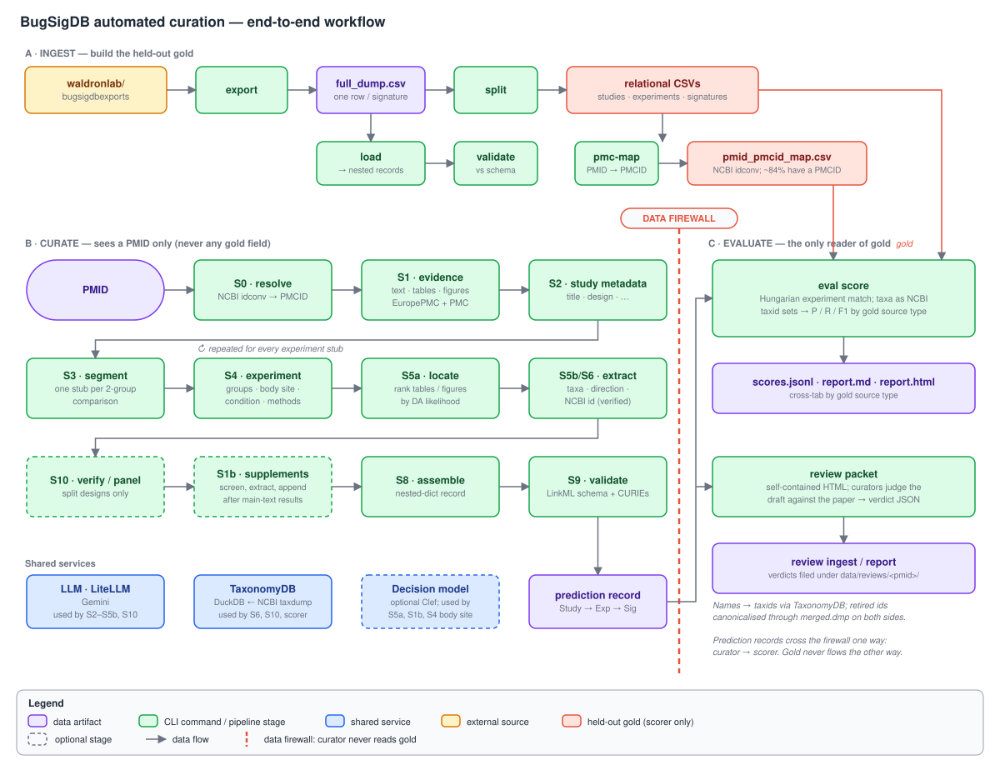
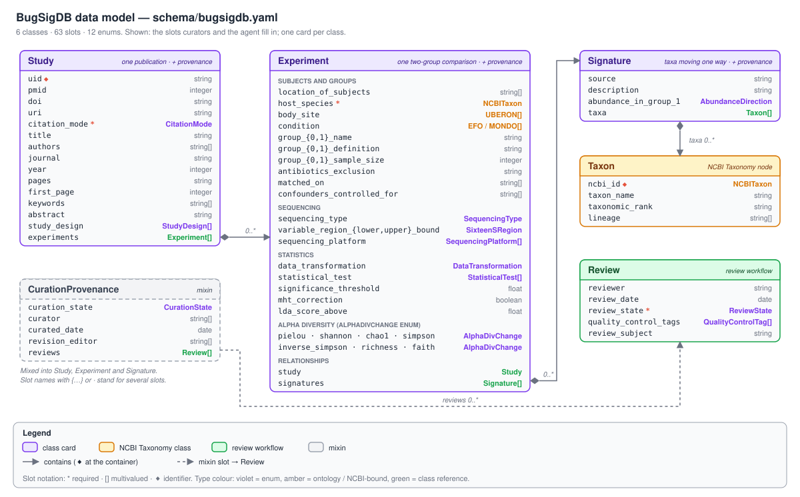

# BugSigDB Curation Schema (LinkML) and automated curator

[](https://github.com/seandavi/bugsigdb-curation-tools/actions/workflows/ci.yml)

A [LinkML](https://linkml.io) representation of the [BugSigDB](https://bugsigdb.org)
curation data model, reverse-engineered from the Semantic MediaWiki + Page Forms
application that curators use, plus the tooling built on it: an **automated de-novo
curator** that turns a PubMed ID into a schema-checked `Study → Experiment → Signature`
record, and an **evaluation harness** that scores those records against the human-curated
BugSigDB corpus.

BugSigDB captures **microbial signatures**: sets of microbial taxa reported as
differentially abundant (DA) between two groups of samples in a published study.

> **Status: research prototype.** The numbers in [Results so far](#results-so-far) come
> from a 19-study smoke set and mostly one or two runs per configuration. Treat them as a
> floor and a direction, not a benchmark. Drafts produced for human review are machine
> output that nobody has yet reviewed; none is presented here as a result. The append-only lab notebook is
> [`docs/LEDGER.md`](docs/LEDGER.md); the draft paper is
> [`paper/bugsigdb-autocuration.qmd`](paper/bugsigdb-autocuration.qmd).

## Contents

- [Workflow at a glance](#workflow-at-a-glance)
- [Methods](#methods)
- [Data model](#data-model)
- [Results so far](#results-so-far)
- [Known limitations](#known-limitations)
- [Layout](#layout)
- [Validate / generate](#validate--generate)
- [CLI reference](#cli)
- [Reproducing the pipeline](#reproducing-the-pipeline)
- [Licensing](#licensing)

## Workflow at a glance

The system has three parts (Figure 1): **A** builds the curated corpus into a
held-out gold set, **B** is the curator, which sees only a PMID, and **C** scores the
curator's output against the gold and routes drafts to human reviewers. A *data firewall*
separates B from the gold: prediction records flow from B to C, never the reverse.

<a id="fig-workflow"></a>
<picture>
  <source media="(prefers-color-scheme: dark)" srcset="docs/figures/workflow-dark.svg">
  
</picture>

**Figure 1. End-to-end workflow.** Lane A (ingest) builds the relational gold tables from
the public BugSigDB export. Lane B (curate) runs the per-PMID pipeline; dashed boxes are
optional stages (`--design split-*` adds S10, `--supplements` adds S1b); the decision model is optional
(`--decision-model`) and feeds S5a, S1b and the S4 body-site sidecar. Lane C (evaluate)
is the only code that reads gold. Source: [`docs/figures/make_figures.py`](docs/figures/make_figures.py).

## Methods

### 1. Corpus and the held-out gold

`bugsigdb export` downloads the merged CSV dump from
[`waldronlab/bugsigdbexports`](https://github.com/waldronlab/bugsigdbexports). The dump is
denormalised (one row per signature, study and experiment columns repeated).
`bugsigdb split` normalises it into five relational tables, and `bugsigdb pmc-map`
maps PMIDs to PubMed Central IDs so that studies with open full text can be curated and
scored. The current corpus is 2,068 studies; 2,052 have a numeric PMID and about 84% of
those resolve to a PMCID.

| Table | One row per | Key columns |
|-------|-------------|-------------|
| `studies.csv` | study | `study_id`, `pmid`, `doi`, `study_design`, `state` |
| `experiments.csv` | experiment | `experiment_id`, `study_id`, group names and sizes, `body_site`, `condition`, methods, alpha diversity |
| `signatures.csv` | signature | `signature_id`, `experiment_id`, `source`, `abundance_in_group_1` |
| `taxa.csv` | distinct taxon | `ncbi_id`, `taxon_name` |
| `signatures_taxa.csv` | signature × taxon | the join between the two |

*Table 1. Relational gold tables written by `bugsigdb split` (column lists abbreviated; see `src/bugsigdb_curation/split.py`).*

**Data firewall.** The curated records are *held-out ground truth, used for scoring only*.
The curator receives a PMID plus whatever source artifacts it fetches itself. It never sees
a curated field (study design, segmentation, body site, condition, group orientation,
taxa, direction, or source), and its taxonomy lookups use NCBI, not the gold `taxa.csv`.
Curator modules do not import `eval`, and `tests/test_curator_firewall.py` guards the
boundary. This matters because an agent that could read the answer would make every
metric meaningless.

### 2. The curator: a per-PMID stage pipeline

`bugsigdb curate --pmid <PMID>` runs the stages in Table 2. Stages S0–S4, S5a, S8 and S9 are
identical for every design; designs differ only in S5b/S6 and S10 (next section).

| Stage | What it does | Notes |
|-------|--------------|-------|
| S0 resolve | PMID → PMCID, DOI | NCBI ID Converter, retried on 429/5xx; if it keeps failing, falls back to Europe PMC's search API |
| S1 evidence | Fetch the article as sections, tables and figures | EuropePMC `fullTextXML` for text and tables (5xx retried); PMC article HTML → CDN URLs for figure images, cached on disk. Fully scriptable, no browser. See [Retrieval](#retrieval-and-its-failure-modes). |
| S2 study | Title, authors, journal, year, study design | One LLM call |
| S3 segment | Propose the list of 2-group comparisons ("stubs") the paper reports | One LLM call over the assembled text |
| S4 experiment | Per stub: groups, sample sizes, host, body site, condition, sequencing, statistics | One LLM call per stub; with `--decision-model`, body site → UBERON term, recorded as a sidecar annotation (the schema slot is unchanged) |
| S5a locate | Rank the tables and figures that may hold the stub's DA result | Keyword regex, or with `--decision-model` a ranking by p(DA artifact) |
| S5b/S6 extract | Per stub: taxa, direction, NCBI taxon id | Depends on `--design`; ids are *verified* against the taxonomy authority, never trusted from the model. Each experiment tries up to 3 ranked candidate artifacts, not one shared artifact |
| S1b supplements | Read the paper's supplementary files and append their experiments | Opt-in (`--supplements`, needs `--decision-model`); see [Optional levers](#5-optional-levers) |
| S10 verify | Adversarial check of extracted taxa and directions | `split-verify` and `split-panel` only |
| S8 assemble | Build the nested-dict record in the loader's shape | |
| S9 validate | Check against `schema/bugsigdb.yaml` | Failures are recorded, not hidden |

*Table 2. Curator stages. The record keeps provenance (`design`, `flags`, annotations) that is never fed back into extraction.*

**Group convention.** BugSigDB puts the reference or control in group 0 and the case in
group 1, and `abundance_in_group_1` is read relative to group 0. S4 is told this, and S5b
and the NER stage are given the group *names*, because a model that does not know which group
is "1" flips directions. By our estimate (from run notes, not re-derived for this README) the
convention holds for about 95% of curated experiments in which a control is identifiable.

**Per-experiment artifact search.** The first version copied one located artifact into
every experiment of a study. Now each experiment tries up to 3 ranked candidates in turn; the
prompt carries an explicit escape hatch ("if this does not report that comparison, return no
taxa") so that a non-matching artifact yields nothing rather than a guess, and a
duplicate-signature guard drops a signature that merely repeats an earlier experiment's
(recorded as `duplicate_signatures_dropped`). A candidate that fails does not abort the study.

#### Retrieval and its failure modes

Retrieval was a large and, at first, silent source of both failures and run-to-run
variance. What the pipeline now does about it:

- **Figures.** PMC serves recent articles' figures as `.webp`, which the original URL
  pattern missed; the pattern is fixed and the image type is sniffed from the bytes.
- **PMC's captcha page.** PMC intermittently answers our client with a captcha page
  (HTTP 200, no figure links). The page is detected and retried with backoff (10, 30, 60,
  120 s), requests to PMC are spaced, and good pages are cached on disk
  (`data/curator/pmc_html`, override with `BUGSIGDB_PMC_HTML_CACHE`). If a figure image still
  cannot be fetched it is flagged (`figure_image_unavailable`) rather than silently
  extracted from the legend alone.
- **Retries elsewhere.** Europe PMC `fullTextXML` 5xx and NCBI idconv 429/5xx are retried;
  every LiteLLM call has a 180 s timeout and 2 retries; MDPI-style JATS author lists are parsed.
- **What we did not do.** PMC's challenge fingerprints the client: in our tests `curl` received
  real pages while `httpx` received the captcha, under both HTTP/1.1 and HTTP/2. We did not try
  to defeat it. PMC's per-file supplement downloads sit behind a JavaScript proof-of-work
  challenge, also not bypassed, and the old OA `oa.fcgi` endpoint now returns 404. So figure
  retrieval in production depends on the cache or on a sanctioned bulk route.

Figures are read with a multimodal model: the image and its legend go in together. An
earlier benchmark ([`benchmarks/figure-extraction/`](benchmarks/figure-extraction/))
found taxa-set F1 of about 0.9 for stacked-bar plots, falling to about 0.6 for
cladograms and heatmaps, with errors mostly missed labels rather than invented ones.
One LEfSe figure had every direction flipped, so group orientation is treated as its own
failure mode.

### 3. Three stage designs

`--design` selects how taxa are extracted and checked. All three share the backbone above.

| Design | S5b/S6 (taxa and ids) | S10 (review) |
|--------|----------------------|--------------|
| `fused-lean` (default) | One call extracts taxa and direction *and* proposes NCBI ids; ids are tool-verified | Structural validation only |
| `split-verify` | NER call returns names and direction only; deterministic name → taxid resolution, with an LLM only to disambiguate homonyms | Adversarial verifier on two failure modes: taxon present in source, and direction; bounded repair (≤ 2 rounds) |
| `split-panel` | As `split-verify` | Independent reviewer re-derives the answer from the source in a fresh context; arbitration and bounded repair |

*Table 3. The three curator designs. Anything unresolved after repair is flagged or dropped, never guessed.*

On the 19-study smoke set at a fixed cheap model, `fused-lean` won on both accuracy and
cost (see [Results so far](#results-so-far)), and is the default.

### 4. Taxon resolution

Predicted taxon *names* must become NCBI taxids for both curation and scoring. A local
DuckDB database is built from a pinned NCBI taxdump (`bugsigdb taxonomy build`; the
smoke runs used release `2026-07-01`). Lookups are offline and handle synonyms
(*Propionibacterium acnes* → *Cutibacterium acnes*), rank prefixes such as
`g__Faecalibacterium`, and retired ids through `merged.dmp`. Live NCBI E-utilities is
used only to fill gaps. An earlier live-only resolver was rate-limited (HTTP 429) at
smoke-set scale, which is why the local database exists.

### 5. Optional levers

Everything here is opt-in and best-effort: with no decision model the pipeline is
unchanged, and a failed decision call falls back to the default behaviour, is recorded in
the sidecar, and never aborts a study.

- **Decision models** (`--decision-model {none,clef,clef-flash}`). Some judgments are
  bounded: is this sheet a DA table, which UBERON term matches this body site. A Cloudflare
  "decision model" (Clef) returns a calibrated probability per option without generating
  text, at far lower cost than a generative call. The seam is
  [`decision.py`](src/bugsigdb_curation/decision.py) (yes/no, choice and score questions, a
  Clef client, a mock, and a JSONL archive of every call, `--decision-archive`); the judgments
  live in [`curator/routing.py`](src/bugsigdb_curation/curator/routing.py). Wired so far:
  - **S5a ranking** of tables and figures by p(DA artifact) instead of the keyword regex.
    On the smoke papers, `clef`'s top-ranked artifact was one the gold cites in 15 of 16
    papers, against 11 of 16 for the regex; `clef-flash` managed 12 of 16, so use `clef`
    (this is an n = 16 check against the gold citations, not a pipeline score).
  - **S4 body site → UBERON.** OLS4 supplies candidate terms (cached by `--ols-cache`) and a
    Clef choice picks one. The result goes into the sidecar only; no schema change.
  - **The supplement lever** and **one-vs-rest expansion** (next bullet).

  An offline probe
  ([`benchmarks/decision-probe/RESULTS.md`](benchmarks/decision-probe/RESULTS.md)) decided
  what to wire: GO for supplement page/sheet screening, DA-artifact ranking, body-site
  ontology and narrow one-vs-rest detection; NO-GO for per-taxon direction, figure type,
  many-option artifact → experiment assignment, and condition ontology as configured. Needs
  `CLOUDFLARE_ACCOUNT_ID` and `CLOUDFLARE_API_TOKEN` in `.env`; ignored with `--mock`.
- **Supplements** (`--supplements`, needs `--decision-model`). Most DA results in the
  hardest papers sit in supplementary files that the main-text pipeline cannot see. The lever
  (stage S1b, [`curator/supplement_lever.py`](src/bugsigdb_curation/curator/supplement_lever.py)):
  1. streams the Europe PMC supplementary ZIP (requested with `includeInlineImage=false`,
     which is what made it fast) under guards: 60 MB download, 240 s, 200 MB uncompressed,
     500 members, and a 25 MB per-member cap;
  2. splits it into units: an xlsx sheet, a csv, a docx, or a PDF page (PDFs go through
     [`pdf.py`](src/bugsigdb_curation/pdf.py), see [Licensing](#licensing));
  3. has Clef screen every unit; one with p(`has_da_results`) ≥ 0.5 is routed on;
  4. runs a generative extraction over the routed units;
  5. expands units the screen labels `multi_group_one_vs_rest` (three or more distinct groups)
     deterministically into "G vs all other groups" experiments, in code;
  6. merges with the main-text experiments and de-duplicates: against the main text at taxon
     Jaccard ≥ 0.5, against another supplement only when it comes from a *different* file with
     the same two groups and Jaccard ≥ 0.8.

  Known limits: a ZIP over the guard is skipped, visibly (`supplement_skipped`); for example
  37864204 ships about 250 MB of mp4 and is not read. Legacy `.xls` and `.doc` are skipped.
  Supplement experiments get no UBERON mapping yet.
- **Ground unresolved** (`--ground-unresolved`, `fused-lean` only, off by default). Taxa whose
  model-proposed id could not be verified are re-resolved by *name* against the NCBI authority
  (local database or live; an LLM only for homonyms).

**The sidecar.** Decision calls and fallbacks are recorded in `CurationResult.annotations`,
written beside `--out` as `<out stem>.annotations.json` (for `--smoke`, under
`<dir>/_annotations/`). Keys include `artifact_ranking`, `experiment_artifacts`,
`body_site_terms`, `supplement_*`, `figure_image_unavailable`,
`duplicate_signatures_dropped`, and `*_error` keys for each judgment that fell back. Review
packets pick the sidecar up automatically.

### 6. Evaluation

`bugsigdb eval score` aligns predictions to gold and reports, per study and in aggregate:

1. **Experiment alignment.** Predicted and gold experiments are matched by a Hungarian
   (max-weight bipartite) assignment on field overlap. Unmatched predictions count as
   over-segmentation, unmatched gold as under-segmentation.
2. **Signature alignment.** Within a matched experiment, signatures are paired by taxa-set
   overlap, *not* by the declared direction label. A systematic Group 0/1 flip then shows
   up as low direction accuracy while taxa precision and recall stay high, rather than
   masquerading as a catastrophic taxa failure.
3. **Taxa as taxid sets.** Names are resolved to NCBI taxids and compared as sets
   (precision, recall, F1, Jaccard; micro and macro). Retired ids are canonicalised on
   both sides before comparison.
4. **Cross-tabulation by gold source type** (main table, figure, supplement). A pipeline
   that cannot read supplements would otherwise be dominated by gold it cannot reach.
5. **Coverage counters** for names that fail to resolve, so name-based scores cannot
   quietly shrink.
6. **Known-bad gold discount.** Gold signatures from incomplete curation (blank `State`)
   do not penalise predicted taxa as false positives.

### 7. Human review

Gold is imperfect, and a draft with no gold has no automatic score. `bugsigdb review`
builds one self-contained HTML packet per draft (a machine-draft banner, a verdict control
for each taxon, signature and experiment, and the evidence beside each claim, with autosave
and JSON/CSV export). A BugSigDB curator judges it against the paper and returns a verdict
JSON, which `review ingest` validates against
[`schema/review_verdict.schema.json`](schema/review_verdict.schema.json) and pins to the
draft's SHA-256; `review report` aggregates verdicts (taxa precision, direction-flip rate and
so on); `review bundle` packages several packets for sharing. Reviewer verdicts never mix
with the held-out gold. Details are in
[Human review packets](#human-review-packets-bugsigdb-review).

A pilot set of five open-access (CC BY) papers was selected for this, none of them in the
BugSigDB export dated 2026-10-06 (selection notes: PMIDs 42654743, 42404767, 42729499,
42328067, 42465072). Their drafts are **unreviewed**: no verdicts have been collected, and
they are not results.

## Data model

A three-level hierarchy, annotated with controlled vocabularies and ontology terms
(Figure 2). The schema is [`schema/bugsigdb.yaml`](schema/bugsigdb.yaml): 6
classes, 63 slots and 12 enums.

<a id="fig-datamodel"></a>
<picture>
  <source media="(prefers-color-scheme: dark)" srcset="docs/figures/data-model-dark.svg">
  
</picture>

**Figure 2. The LinkML data model.** `Study` (one publication, identified by `uid`, the
wiki page name; usually a PMID) contains `Experiment`s (one two-group comparison, Group 0 =
control, Group 1 = case), each containing `Signature`s (taxa that moved one way in Group 1),
each listing `Taxon` nodes. `CurationProvenance` is a mixin carrying curation state and
reviews. Only the slots curators and the agent fill in are shown; the schema has more.

Ontology bindings: condition → EFO/MONDO, body site → UBERON, host species and signature
taxa → NCBI Taxonomy. Ontology-bound slots are string-ranged in the schema, with the binding
documented in comments. Every class, slot, and enum carries a `description` plus
dual-audience `comments`: `CURATOR:` for humans, `AGENT:` for the automated extractor.

## Results so far

Smoke set: 19 studies, `gemini-3.1-flash-lite` (the cheapest multimodal tier), text +
tables + figures, `fused-lean`, scored against the held-out gold. Every row below is one or
two runs; there are no confidence intervals. The ledger is the record of each run
([`docs/LEDGER.md`](docs/LEDGER.md): L027, L030, L031, L032, L033).

| Configuration | Runs | Micro F1 | Micro precision | Direction accuracy | Figure F1 |
|---------------|-----:|---------:|----------------:|-------------------:|----------:|
| Before the retrieval and prompt fixes (L030) | 1 | 0.134 | 0.457 | 63.6% | 0.520 |
| After them: webp figures, captcha handling, group convention | 2 | 0.158, 0.185 | 0.447, 0.474 | 89.7%, 90.0% | 0.586, 0.671 |
| Per-experiment artifact search, no decision model | 1 | 0.166 | 0.829 | 96.0% | 0.612 |
| Per-experiment artifact search + `clef` decision model | 1 | 0.209 | 0.636 | 90.3% | 0.736 |

*Table 4. Smoke-set taxa-set metrics (micro-averaged), by configuration. Row 1 is from L030;
rows 2–4 are from local score reports under the git-ignored `data/runs/`, for which L033 is
the ledger entry. The studies are the same, the code is not, so adjacent rows show a
direction and are not a controlled ablation.*

What the numbers say, and what they do not:

- **Earlier smoke numbers are superseded.** L027 and L030 were taken while figure images were
  silently missing for recent PMC articles (the `.webp` and captcha problems under
  [Retrieval](#retrieval-and-its-failure-modes)), which probably depressed them. Treat
  the first row as a "before" reference and not as a measure of the design.
- **Recall is still the bottleneck.** About 77% of the smoke set's gold taxa are in
  supplements the main-text pipeline cannot reach (L027: 1,056 supplement-sourced gold taxa,
  against 260 from figures and 51 from main tables), and micro recall in Table 4 stays between
  0.08 and 0.13.
- **Direction orientation.** Stating the group convention and passing group names to the
  extractors raised direction accuracy from about 65% to about 81%, pooled over two runs each
  (per run: 68% and 60% before, 86% and 75% after). The later rows range from 90% to 96%.
- **Run-to-run variance fell.** The per-study F1 difference between two runs averaged 0.05
  after the fixes; before them, single studies swung between 0.96 and 0.0 across runs.
- **The decision-model row is one run per arm.** The `clef` arm has higher F1 and lower
  precision than the arm without; with one run each, that gap is not shown to be real.
- **Supplement lever, one paper (34620922, 48 experiments, supplement-heavy).** The baseline
  scored F1 0.000 with 7 of 48 experiments matched. With `--supplements`, three runs scored
  F1 0.46 to 0.66 with 47 to 48 of 48 experiments matched. This is n = 1 paper and was chosen
  because it is the hardest supplement case.
- **Design comparison (L030, before the retrieval fixes).** Micro F1: `fused-lean` 0.134,
  `split-panel` 0.031, `split-verify` 0.018. The split designs' verifier grounded
  figure-derived taxa against legend text only, which structurally drops correct figure taxa;
  that was fixed afterwards (figure images now reach the verifier) but the comparison was not
  re-run.
- **A strong model with the evidence in hand (L031, n = 1).** Given one paper's supplementary
  PDF directly, `gemini-3.1-pro-preview` scored taxa-set F1 0.83 on a 48-experiment paper
  the main-text pipeline scored 0.00 on. The PDF was hand-fed: a ceiling test, not a pipeline
  result. Its direction accuracy of 11.5% was diagnosed in L031 as a global group-orientation
  mismatch.
- **Decision-model probe (L032, [details](benchmarks/decision-probe/RESULTS.md)).** Offline,
  against gold, on small n with agent-drafted, unreviewed labels: supplement page/sheet
  screening reached recall 1.0 at precision 0.77 or better; DA-artifact ranking had AUROC 0.96
  (`clef`) against the regex's single operating point of precision 0.39, recall 0.65. Per-taxon
  direction, figure type, many-option artifact → experiment assignment and condition
  ontology (as configured) did not meet their gates.

The reading so far is that the low headline F1 is mostly a *retrieval* problem, not a
reasoning problem. Remaining levers, in rough order: reliable figure and supplement retrieval,
fan-out for many-experiment papers, a model sweep, and human review for papers with no gold.

### Known limitations

- **Retrieval is fragile.** Figure retrieval depends on PMC pages that are served
  intermittently; in production it needs the on-disk cache or a sanctioned bulk route. PMC's
  supplement downloads (JavaScript proof-of-work) are not reachable by this client at all, so
  `--supplements` uses Europe PMC's ZIP instead.
- **The supplement ZIP guard skips large archives.** A ZIP with big media, such as 37864204's
  roughly 250 MB of mp4, exceeds the guard and is skipped (visibly, as `supplement_skipped`).
  `.xls` and `.doc` files are not read, and supplement experiments get no UBERON term.
- **Small samples.** The smoke set has 19 studies, one or two runs per configuration, and one
  model tier. The supplement result is one paper. The decision-model probe is two large papers
  and 15 figures, with unreviewed labels.
- **Unreviewed drafts.** The five pilot review packets contain machine drafts that no curator
  has judged. There is no human-verified accuracy figure yet.

## Layout

| Path | Contents |
|------|----------|
| `schema/bugsigdb.yaml` | The LinkML schema. 6 classes, 63 slots, 12 controlled-vocabulary enums. |
| `schema/review_verdict.schema.json` | JSON Schema for reviewer verdict files. |
| `src/bugsigdb_curation/` | The `bugsigdb` CLI. `curator/` (pipeline stages), `eval/` (gold join and scorer), `taxonomy/` (DuckDB backend), `review/` (packets, bundles, verdicts), plus loader, split, export, validate. |
| `src/bugsigdb_curation/decision.py` | The decision-model seam: question types, `ClefDecisionModel`, `MockDecisionModel`, JSONL call archive. |
| `src/bugsigdb_curation/curator/routing.py`, `ols.py` | The judgments routed through the decision model (artifact ranking, body-site mapping) and the OLS4 term search behind the latter. |
| `src/bugsigdb_curation/curator/supplement_lever.py` | Stage S1b: unit screening, extraction, one-vs-rest expansion, de-duplication. Its fetch side is `supplements.py`. |
| `src/bugsigdb_curation/pdf.py` | PDF text, page size and JPEG rendering on pypdfium2 + Pillow, behind one error type. |
| `sources/` | Local snapshot of the wiki schema pages the schema was derived from. |
| `benchmarks/` | `figure-extraction/` (vision benchmark) and `decision-probe/` (decision-model probe; `RESULTS.md` has the tables and verdicts). |
| `docs/` | `LEDGER.md` (lab notebook), `plans/` (research brief, workflow plan, ontology plan), `workflow.md` (older Mermaid view), `figures/` (README figure generator). |
| `paper/` | Quarto draft of the methods paper. |
| `tests/` | pytest suite. Network-marked tests are deselected by default. |

### `sources/` — the source material

A faithful scrape of the curation schema as encoded at bugsigdb.org (the site is
behind Cloudflare, so pages were pulled via the MediaWiki API at `/w/api.php`):

- `forms/` — Page Forms definitions (input types, mandatory flags, defaults, conditional display).
- `templates/` — how form fields map to stored semantic properties.
- `properties/` — one file per SMW property; datatypes and the tooltip text shown to curators.
- `values/` — snapshots of the controlled-vocabulary value lists (countries, host species, body sites, statistical tests, …).
- `help/` — human curation guidance pages.

## Validate / generate

```bash
uvx --from linkml gen-json-schema schema/bugsigdb.yaml   # -> JSON Schema
uvx --from linkml gen-owl         schema/bugsigdb.yaml   # -> OWL
uvx --from linkml gen-pydantic    schema/bugsigdb.yaml   # -> Pydantic models
```

## CLI

`bugsigdb export` downloads the generated export artifacts (merged CSV dump
and/or GMT signature sets) from the [`waldronlab/bugsigdbexports`](https://github.com/waldronlab/bugsigdbexports)
repo:

```bash
uv run bugsigdb export --list              # see what's available, no download
uv run bugsigdb export                     # full_dump.csv + file_size.csv -> data/exports/
uv run bugsigdb export --select gmt        # GMT signature sets instead
uv run bugsigdb export --select all        # everything
uv run bugsigdb export --ref v1.2.3        # a specific tag/branch instead of devel
uv run bugsigdb export --force             # re-download even if a same-size file exists
```

Existing files are skipped when their size already matches the remote (use
`--force` to override). Downloads stream to disk with bounded concurrency and
a `rich` progress bar; run `uv run bugsigdb export --help` for all options.

`bugsigdb validate` checks one or more curated instance files (YAML or JSON,
each holding a single object or a list of objects) against the LinkML schema,
using the [`linkml` validator](https://linkml.io/linkml/schemas/validation.html):

```bash
uv run bugsigdb validate study.yaml                          # validate as a Study (default)
uv run bugsigdb validate study.yaml other.yaml                # multiple files in one invocation
uv run bugsigdb validate experiment.yaml -C Experiment         # validate against a different class
uv run bugsigdb validate study.yaml --schema my-schema.yaml    # override the schema
uv run bugsigdb validate study.yaml --format json              # machine-readable report
```

Exit codes: `0` if every instance is valid, `1` if any instance fails schema
validation (bad enum value, wrong type, missing required field, …), `2` for
usage/IO errors (file not found, unparseable YAML/JSON, unknown
`--target-class`, bad `--schema` path). Run `uv run bugsigdb validate --help`
for all options.

`bugsigdb load` parses a `full_dump.csv` export (denormalized: one row per
Signature, with Study/Experiment columns repeated) into nested
Study -> Experiment -> Signature records matching `schema/bugsigdb.yaml`'s
slot names:

```bash
uv run bugsigdb load data/exports/full_dump.csv                     # -> YAML on stdout
uv run bugsigdb load data/exports/full_dump.csv --format json       # JSON instead
uv run bugsigdb load data/exports/full_dump.csv -o studies.yaml      # to a file
uv run bugsigdb load data/exports/full_dump.csv --limit 20           # first 20 studies only
```

Studies are keyed by `uid` (the stable `Study` page name, always present);
`pmid` is captured separately as an optional integer when present. Cells are
coerced to the schema's types (ints, floats, bools,
enum values) and multivalued cells are split into lists; blank ("NA") cells
are simply omitted rather than defaulted or invented. `MetaPhlAn taxon names`
and `NCBI Taxonomy IDs` are paired up into `Taxon` records (id + name + rank
+ lineage). The output is plain nested dicts (no `linkml`/`pydantic`
dependency) so it can later be checked structurally, e.g. by a `bugsigdb
validate` command. See `bugsigdb_curation/loader.py` for the exact
column -> slot mapping and delimiter conventions (derived from inspecting the
real dump, not just the wiki docs — some columns disagree with the wiki's
documented delimiters).

`bugsigdb pmc-map` maps curated studies' PMIDs to PubMed Central IDs
(PMCIDs) via the [NCBI PMC ID Converter API](https://www.ncbi.nlm.nih.gov/pmc/tools/id-converter-api/),
producing a gold/eval set for de-novo curation workflows (which typically
need PMC full text, not just a PubMed abstract):

```bash
uv run bugsigdb pmc-map                                  # data/exports/relational/studies.csv -> data/eval/pmid_pmcid_map.csv
uv run bugsigdb pmc-map --input studies.csv --output map.csv
uv run bugsigdb pmc-map --email me@example.org            # NCBI etiquette for unauthenticated use
uv run bugsigdb pmc-map --limit 50                        # first 50 distinct PMIDs only, for testing
```

Reads distinct numeric PMIDs from a relational `studies.csv` (as produced by
`bugsigdb split`; the 16 or so studies with no PMID at all are skipped),
queries idconv in batches of 200 with bounded (3-way) concurrency, and
writes `study_id,pmid,pmcid,doi,has_pmc` — one row per study, so studies
that share a PMID both appear. A coverage summary (`N PMIDs: M with PMCID
(X%), K without.`) is printed to stderr. Of the current 2068 curated
studies, 2052 have a numeric PMID, of which about 84% resolve to a PMCID.

`--limit` truncates the *distinct PMID* list before querying, not the study
rows — so any study row whose PMID falls outside that truncated subset is
excluded from the output CSV (its PMID was simply never queried). When that
happens, a `Note: N study row(s) excluded (PMID outside --limit).` line is
printed to stderr so the row-count drop isn't silent.

`bugsigdb split` normalises a flat `full_dump.csv` into the five relational CSVs
described in Table 1 (default `data/exports/relational/`). These tables are the held-out
gold: only `eval score` and `eval gold` read them.

```bash
uv run bugsigdb split                                        # data/exports/full_dump.csv -> data/exports/relational/
uv run bugsigdb split --input dump.csv --output-dir out/
```

### De-novo curation (`bugsigdb curate`)

`bugsigdb curate` takes a PMID and writes a schema-checked prediction record in exactly
the shape `eval score` consumes. It never takes a gold path. See [Methods](#methods) for
what each stage and flag does.

```bash
uv run bugsigdb curate --pmid 21850056 -o pred.json                  # Gemini via LiteLLM, fused-lean
uv run bugsigdb curate --pmid 21850056 --mock                        # mock LLM: no model key needed (still fetches the paper)
uv run bugsigdb curate --pmid 21850056 --design split-verify         # or split-panel
uv run bugsigdb curate --smoke -o preds/                             # the curator's ~20-study smoke set
uv run bugsigdb curate --pmid 34620922 --decision-model clef --supplements -o pred.json
```

Flags (`uv run bugsigdb curate --help` lists all of them):

| Flag | Meaning |
|------|---------|
| `--pmid TEXT` / `--smoke` | Curate one PMID, or every study in the curator's smoke set (`--smoke` requires `--out` as a directory). |
| `--model TEXT` | LiteLLM model id for the real backend (default `gemini/gemini-3.1-flash-lite`). |
| `--mock` | Deterministic offline model, no API key (the paper is still fetched). |
| `--design [fused-lean\|split-verify\|split-panel]` | Stage design (default `fused-lean`). |
| `--decision-model [none\|clef\|clef-flash]` | Route S5a artifact ranking and the S4 body site → UBERON mapping through a Cloudflare decision model (default `none`; needs the Cloudflare keys in `.env`; ignored with `--mock`). |
| `--decision-archive PATH` | JSONL record of every decision-model call (default: `<out>.decision.jsonl`, or `decision.jsonl` in the `--smoke` directory). |
| `--ols-cache PATH` | EBI OLS4 term-search cache for the UBERON mapping (default `data/curator/ols_cache.json`; used only with `--decision-model`). |
| `--supplements / --no-supplements` | Also read the supplementary files: the decision model screens each sheet or page and the routed ones are extracted and appended after the main-text experiments (needs `--decision-model`). |
| `--ground-unresolved / --no-ground-unresolved` | `fused-lean` only: resolve taxa whose model-proposed NCBI id could not be verified by name against the NCBI authority. |
| `--taxonomy-db PATH`, `--taxonomy-release TEXT`, `--taxonomy-cache PATH` | Local taxonomy database (tried before live NCBI), its release label, and the curator's own resolver cache. |
| `--out/-o PATH`, `--format [yaml\|json]`, `--email TEXT`, `--config TEXT` | Output path, serialisation (single `--pmid` only), NCBI contact email, and an informational source-config label. |
| `--log-format [console\|json]`, `--log-level TEXT` | Structured-log sink and level. |

Keys go in `.env`: a LiteLLM `gemini/` key (`GOOGLE_API_KEY` or `GEMINI_API_KEY`) for the
curator model; `CLOUDFLARE_ACCOUNT_ID` and `CLOUDFLARE_API_TOKEN` for decision models; an
optional `NCBI_API_KEY` raises the NCBI rate limit. When the run produces sidecar
annotations (decision-model calls, body-site → UBERON, fallbacks), they are written to
`<out stem>.annotations.json` next to the prediction (for `--smoke`, `<dir>/_annotations/`).
`--taxonomy-db` / `--taxonomy-release` choose the local taxonomy database (below); without one
the curator falls back to live NCBI.

### Taxonomy backend (`bugsigdb taxonomy`)

```bash
uv run bugsigdb taxonomy build --download --release 2026-07-01     # NCBI taxdump -> DuckDB (cached under XDG cache)
uv run bugsigdb taxonomy build --taxdump taxdump.tar.gz --release 2026-07-01
uv run bugsigdb taxonomy lookup "Propionibacterium acnes"          # name -> tax_id (synonyms, merged ids)
uv run bugsigdb taxonomy lookup --taxid 1747                       # tax_id -> name + lineage
```

The database path resolves as `--db` > `BUGSIGDB_TAXONOMY_DB` > newest cached
`ncbi-taxdump-*.duckdb`.

### Scoring (`bugsigdb eval`)

```bash
uv run bugsigdb eval score --pred preds/ --out report/ --smoke      # -> scores.jsonl, report.md, report.html
uv run bugsigdb eval gold --smoke -o gold.yaml                      # dump gold in the prediction shape
```

`score` reads the relational gold (`--relational`) and the PMID → PMCID map
(`--pmc-map`); see [Evaluation](#6-evaluation) for the metrics.

### Supplement inspection (`bugsigdb supplements`)

```bash
uv run bugsigdb supplements --pmid 34620922                  # list a paper's supplementary files
uv run bugsigdb supplements --pmcid PMC8000000 --dump out/   # also write raw + parsed text
```

Read-only and standalone: it uses public EuropePMC/NCBI data and touches no gold. The
extraction path is `curate --supplements`.

### Human review packets (`bugsigdb review`)

Drafts written by `bugsigdb curate` have no gold, so BugSigDB curators' verdicts
are the evaluation. A **review packet** is one self-contained `.html` file (inline
CSS/JS, no network requests): the reviewer opens it, judges the draft against the
paper, clicks *Export*, and sends back one JSON file.

```bash
# 1. build a packet (+ <pmid>.manifest.json pinning the draft's sha256)
uv run bugsigdb review packet --pred preds/21850056.json --out packets/ \
    --model-label gemini-3-pro --design-label split-verify
#    picks up preds/21850056.annotations.json automatically; --offline skips fetching evidence,
#    --evidence-dir DIR caches it (complete fetches only; --refresh-evidence refetches),
#    --pmcid overrides the PMID->PMCID lookup
# 2. combine a directory of packets into ONE shareable bundle (index.html + packets + docs) and zip it
uv run bugsigdb review bundle --packets packets/ --out share/ --contact "Jane Doe <jane@example.org>"
#    -> share/bugsigdb-review-<date>/ and share/bugsigdb-review-<date>.zip; send the zip to named reviewers
# 3. file returned verdicts (validated against schema/review_verdict.schema.json)
uv run bugsigdb review ingest ~/Downloads/verdicts_21850056_*.json --manifests packets/   # -> data/reviews/<pmid>/
# 4. aggregate
uv run bugsigdb review report --reviews data/reviews --out report.md
```

Figure images are embedded only when the article's EuropePMC licence is CC BY or
CC0 (each image under ~1.5 MB, all images together under ~6 MB); otherwise the packet
shows the legend and a link. `ingest` refuses verdicts whose `draft_sha256` differs
from the manifest, and refuses to overwrite a different file already filed for the
same reviewer and second, unless `--force`; re-ingesting an identical file is a no-op. Verdicts contain reviewer names/emails: `data/` is git-ignored.

#### Sharing packets: `bugsigdb review bundle`

Reviewers (BugSigDB curators) have no accounts, so the recommended way to share is
one zip sent to named reviewers. `review bundle --packets DIR --out DIR2` turns a
directory of packets into a folder `DIR2/<name>/` (and, by default, `DIR2/<name>.zip`)
holding:

- `index.html` — a self-contained landing page (inline CSS, no JavaScript, no external requests): a
  "machine-generated, unreviewed" notice, how to review, and one card per study (title, authors,
  journal/year, PMID/PMCID/DOI links, licence, experiment/signature/taxon counts, the figures and
  tables the draft cites, an *Open packet →* link, file size, packet id);
- `packets/<pmid>.html` and `packets/<pmid>.manifest.json` — the packets, copied byte for byte;
- `README.txt` (the how-to and the verdict legend, for people who read the zip listing first),
  `ATTRIBUTION.txt` (authors, journal, DOI and licence per study; flags packets whose licence is not
  CC BY/CC0 or whose images were not embedded) and `manifest.json` (every file's sha256 and size, the
  packets' ids and draft hashes, the build date, the builder commit when the packets agree on it, and `content_sha256` — the
  sha256 of the sorted `path<TAB>sha256` lines of `packets/*.html` and `packets/*.manifest.json` only, which the index footer
  also shows. It does not cover `index.html`, `README.txt` or `ATTRIBUTION.txt` (the contact address is outside it), so it
  says the packets match, not that the bundle does; the sha256 of `manifest.json` identifies the whole bundle).

Options: `--name` (default `bugsigdb-review-<date>`), `--contact "name <email>"` (where reviewers send
their verdict files; shown in the index and README), `--zip/--no-zip` (default `--zip`), `--date YYYY-MM-DD`
(default today; recorded in the manifest — the only clock reading). The build is offline and
deterministic: the same packets, name, date and contact give byte-identical files, and a
byte-identical zip on the same Python and zlib build (sorted members, fixed 2000-01-01 timestamps and
permissions; deflate output can differ between zlib versions, so across machines compare `manifest.json`,
not the zip). It refuses (exit 2) a packet whose file name is not a numeric PMID, without a manifest, with
a `packet_id`, `pmid` or `draft_sha256` that does not match its embedded record, that embeds figure images
without a CC BY/CC0 licence or without any author to credit, an empty directory, or an existing `<name>/`
folder or `<name>.zip`; image-less or non-CC-BY packets and packets whose evidence fetch had problems only
warn. The folder and zip are written to temporary names and renamed into place. It never modifies the
packets.

Caveats: some institutional mail gateways strip or quarantine zips that contain `.html`/`.js` — if a
reviewer does not receive it, fall back to a shared drive / Box link or a private GitHub release
asset. Reviewers must **extract the zip before opening** a packet (not from a zip preview or an
attachment viewer), or the page's script will not run.

The loop: build packets → `review bundle` → send the zip → reviewers export verdict JSON and send it
back → `review ingest` → `review report`.

## Reproducing the pipeline

```bash
uv sync
uv run bugsigdb export                                   # 1. download full_dump.csv
uv run bugsigdb split                                    # 2. -> relational gold tables
uv run bugsigdb pmc-map                                  # 3. -> data/eval/pmid_pmcid_map.csv
uv run bugsigdb taxonomy build --download --release 2026-07-01   # 4. local taxonomy DB
uv run bugsigdb curate --smoke -o preds/                 # 5. curate the smoke set (needs a model key)
uv run bugsigdb eval score --pred preds/ --out report/ --smoke   # 6. score against gold
uv run pytest                                            # offline test suite
```

Keys, in `.env`: `GOOGLE_API_KEY` for the curator model; `CLOUDFLARE_ACCOUNT_ID` and
`CLOUDFLARE_API_TOKEN` to use decision models; `NCBI_API_KEY` (optional). To run the optional
levers, add flags to step 5:

```bash
uv run bugsigdb curate --smoke -o preds/ --decision-model clef                  # S5a ranking + body-site sidecar
uv run bugsigdb curate --pmid 34620922 --decision-model clef --supplements -o pred.json   # + supplement lever
```

Local caches, all under the git-ignored `data/`: `data/curator/pmc_html/` (PMC article pages;
`BUGSIGDB_PMC_HTML_CACHE` overrides), `data/curator/ols_cache.json`,
`data/curator/ncbi_taxonomy_cache.json`, plus run outputs and `data/reviews/`. Because PMC
serves a captcha to our client intermittently (see
[Retrieval](#retrieval-and-its-failure-modes)), a run's figure coverage depends on this cache,
and a re-run with a warm cache is not the same experiment as a cold one.

`data/` is git-ignored: it holds the export, gold tables, run outputs and reviewer
verdicts (which contain reviewer names and emails). Each run's results in
[`docs/LEDGER.md`](docs/LEDGER.md) are anchored to a commit and the pinned taxonomy release.
To regenerate the README figures: `python docs/figures/make_figures.py` (stdlib only).

## Licensing

Schema: released under [CC BY 4.0](https://creativecommons.org/licenses/by/4.0/),
consistent with BugSigDB.

Code: this repository has **no `LICENSE` file yet**; no licence has been chosen for the code,
and choosing one is an open decision.

PDF reading (supplement pages: text, size, JPEG render) goes through `bugsigdb_curation.pdf`, built on
[pypdfium2](https://github.com/pypdfium2-team/pypdfium2) (BSD-3-Clause / Apache-2.0) and Pillow (MIT-CMU). It
replaced PyMuPDF, whose AGPL-3.0 licence (or commercial licence) would have made the whole project copyleft.
PyMuPDF is no longer a dependency.
