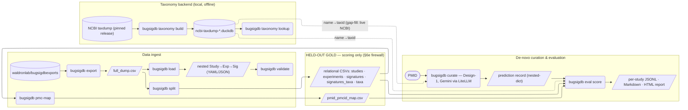
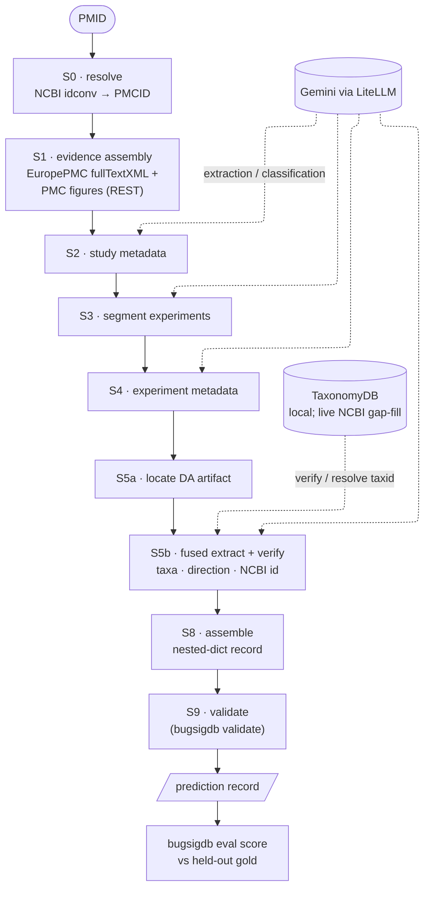

# BugSigDB curation — workflow & CLI map

Two views of the system. Rendered by GitHub (and any Mermaid-aware viewer); the
`elk` renderer is requested for a cleaner layout, falling back to the default
engine where `elk` isn't bundled. Kept in sync with the plans in
[`docs/plans/`](plans/) and the ledger [`docs/LEDGER.md`](LEDGER.md).

---

## 1. `bugsigdb` commands & data flow

Rounded = a CLI command; `[/…/]` = a data artifact; `[( … )]` = an external
source or store. The **held-out gold** (relational CSVs + PMID→PMCID map) flows
**only** to `eval score`, never to `curate` — the §6e data firewall.

---

## 2. Design-1 (Fused-Lean) curation stage DAG

The per-PMID pipeline. Solid arrows = data flow S0→S9; dashed = a shared
service. The curator receives **only** a PMID + the source it fetches itself.

---

*Not shown (deferred): supplement fetching (S1b), the Split-Verify / Split-Panel
designs' verifier & reviewer stages (S10), and ontology CURIE mapping (S7). See
`docs/plans/de-novo-curation-workflow-plan.md` §6.*
