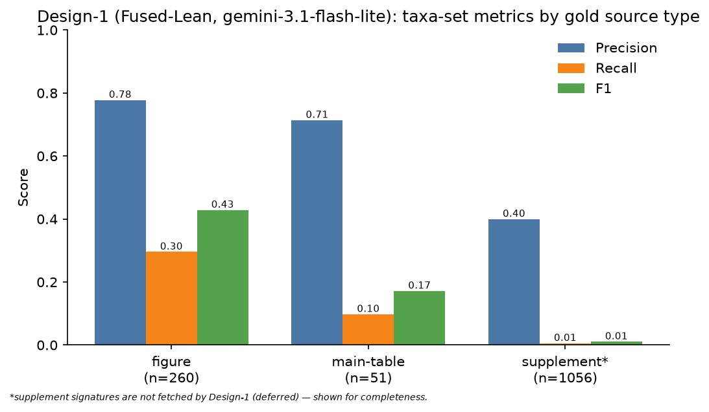

# Background

[BugSigDB](https://bugsigdb.org) is a community-curated database of published
**microbial signatures**: for a given contrast (e.g. cases vs. controls at a body
site), the set of microbial taxa reported as increased or decreased. Each curated
record is a nested `Study → Experiment → Signature` structure; a *Signature* is a
direction-labelled set of taxa, each ideally resolved to an NCBI Taxonomy
identifier. Curation is performed by humans reading each paper and is the
principal throughput bottleneck.

Automating curation is attractive but hard for reasons specific to this domain:

1. **The payload lives where plain text can't see it.** Across the corpus,
   signatures are sourced roughly **57% from figures, 21% from supplements, 16%
   from main tables**, and the remainder from abstract-stated results. A
   full-text API returns body prose and inline tables but not figure contents or
   supplementary files, and it strips italicised genus/species names from prose.
2. **Hallucination concentrates at the identifier layer.** An LLM will readily
   invent a plausible genus or a plausible NCBI id. Every emitted identifier must
   be verified against an authority, never generated free-hand, and every taxon
   must trace to a cited source.
3. **The gold is imperfect and hard to align.** Predictions and gold share no
   ids; experiment segmentation differs; some curated ids have since been retired
   by NCBI. Scoring must be alignment-based and robust to these.

A prior feasibility benchmark (15 figure-sourced studies, six figure types)
established that a vision model, given a figure image plus its legend, recovers
the curated taxa with F1 ≈ 0.9 for simple stacked-bar plots degrading to ≈ 0.6
for cladograms/heatmaps, with error dominated by *recall* (missed small labels)
rather than fabrication — motivating a figure-aware pipeline. This paper reports
the first end-to-end *de novo* curation result.

# Materials and methods

## Data and the held-out-gold firewall

The curated corpus is exported from `waldronlab/bugsigdbexports` and split into
relational tables (2,068 studies · 8,942 experiments · 14,670 signatures · 9,274
distinct taxa). PubMed identifiers are mapped to PubMed Central via NCBI's ID
converter; **1,732 / 2,052 (84%)** have full text.

The human-curated records are treated as **held-out ground truth used only for
scoring**. The curator receives *only* a PMID and the source artifacts it fetches
itself; no curated field (study design, segmentation, body site, group
orientation, taxa, direction, source) is ever visible to extraction. Only the
scoring harness reads gold. This firewall is enforced by an import boundary and a
guard test.

## Output contract

The extraction target is a [LinkML](https://linkml.io) schema (6 classes, 63
slots, 12 enums) reverse-engineered from the BugSigDB curation forms. Every
emitted record is validated structurally against it.

## The curation pipeline (Design-1, "Fused-Lean")

The pipeline is a stage DAG (@fig-workflow). This paper evaluates the leanest of
three planned designs — **Fused-Lean**: a single model call extracts taxa,
direction, *and* proposes an NCBI id per taxon, with the id verified (not
generated) against the taxonomy authority; validation is structural only.

```{mermaid}
%%| label: fig-workflow
%%| fig-cap: "The Design-1 (Fused-Lean) de novo curation stage DAG. The curator receives only a PMID and the source it fetches itself; the local taxonomy DB and the LLM are shared services."
flowchart TD
  PMID(["PMID"]) --> S0["S0 · resolve (NCBI idconv)"]
  S0 --> S1["S1 · evidence assembly<br/>EuropePMC fullTextXML + PMC figures"]
  S1 --> S2["S2 · study metadata"] --> S3["S3 · segment experiments"]
  S3 --> S4["S4 · experiment metadata"] --> S5a["S5a · locate DA artifact"]
  S5a --> S5b["S5b · fused extract + verify<br/>taxa · direction · NCBI id"]
  S5b --> S8["S8 · assemble"] --> S9["S9 · validate"] --> PRED[/"prediction record"/]
  LLM[("Gemini via LiteLLM")] -. "extract / classify" .-> S5b
  TDB[("local TaxonomyDB<br/>live NCBI gap-fill")] -. "verify / resolve" .-> S5b
```

Evidence (§S1) is retrieved over public REST: EuropePMC `fullTextXML` for
sections and main tables, and the PMC article HTML → CDN image URLs for figures.
Supplements are **not** fetched in this design. The model backend is accessed
through [LiteLLM](https://litellm.ai) (Google-first); results here use
`gemini-3.1-flash-lite`, the cheapest multimodal tier.

## Offline taxonomy resolution

Taxon *names* are resolved to NCBI *taxids* by a local DuckDB database built from
a pinned NCBI taxdump release (**2026-07-01**: 4.81M names, 2.85M nodes). It
provides full synonym coverage (e.g. *Propionibacterium acnes* → *Cutibacterium
acnes*, taxid 1747), rank-prefix handling (`g__Faecalibacterium`), and — via the
release's **99,687** `merged.dmp` mappings — **canonicalisation of retired taxids
to their current successors**, applied symmetrically to gold and predicted ids
before comparison. Resolution is offline and sub-millisecond; live NCBI
E-utilities is used only as gap-fill. This replaced an initial live-only resolver
that was rate-limited (HTTP 429) at smoke-set scale.

## Evaluation harness

Predictions are scored against the gold join with alignment-based metrics: a
bipartite (Hungarian) match of predicted↔gold experiments; within matched
experiments, signatures aligned and scored as **NCBI-taxid sets** (precision,
recall, F1, Jaccard; micro and macro), plus direction accuracy and a name→id
sub-score. Over-/under-segmentation is reported separately from field accuracy.
Crucially, every metric is **cross-tabulated by the gold `source` type**
(main-table / figure / supplement), because a text+table+figure pipeline cannot
reach supplement-sourced signatures and the aggregate would otherwise be
dominated by them. Predicted names that fail to resolve, and gold ids that fail
to resolve to a name, are reported as explicit coverage counters so the
name-based sub-scores cannot silently shrink.

## Reproducibility

All results are anchored to a specific commit and the pinned 2026-07-01 taxdump
release. The full development history is recorded in `docs/LEDGER.md`
(append-only lab notebook); the pipeline is regenerated with
`export → split → pmc-map → taxonomy build → curate → eval score`. Development
followed a review-gated pull-request workflow with CI on Python 3.11/3.12.

# Results

We curated a 19-study smoke set spanning source types and experiment counts.
**All 19 studies completed with zero errors** (the earlier live-resolver run had
failed 14/19 on NCBI rate limiting); 7 records were structurally valid.

The headline metrics are dominated by the source mix — 1,056 of 1,367 gold taxa
in this set are supplement-sourced and therefore structurally unreachable by
Design-1. Read on the **reachable** source types (@fig-f1, @tbl-bysource):

| source type | gold taxa | Precision | Recall | **F1** | Jaccard |
|---|---:|---:|---:|---:|---:|
| **figure** | 260 | 0.78 | 0.30 | **0.43** | 0.27 |
| **main-table** | 51 | 0.71 | 0.10 | **0.17** | 0.09 |
| supplement *(unreachable)* | 1,056 | 0.40 | 0.01 | 0.01 | 0.01 |

: Taxa-set metrics by gold source type, micro-averaged. {#tbl-bysource}

{#fig-f1 width=85%}

Additional findings:

- **Direction accuracy: 80.8%** on aligned signatures; **name→id accuracy:
  100%** (when a predicted name resolves, its taxid is correct); **0 gold taxids
  failed to resolve to a name** (the local DB + merged-id canonicalisation fully
  cover the gold).
- **Recall collapses on many-experiment papers.** Stratified by experiment count,
  the ≥21-experiment stratum scores recall ≈ 0.01 — the linear single-worker
  pipeline under-segments large papers (corpus under-segmentation total = 109),
  the anticipated limitation of the current topology.
- **Precision is consistently high (0.71–0.78) on reachable sources**, i.e. the
  model's *verified* extractions are usually right; it simply extracts too few of
  them.

# Conclusions

At the cheapest configuration — the leanest design and the cheapest model tier,
without supplements, in a single run — Design-1 recovers figure-sourced
signatures at **F1 = 0.43** with strong precision and recall as the clear,
named bottleneck. This is a **floor**, and a trustworthy one: the taxonomy layer
is local and churn-corrected, scoring canonicalises retired ids, and coverage is
reported explicitly rather than assumed.

The recall bottleneck has three separable causes, in expected order of impact:
(i) the **supplement gap** (77% of this set's gold; a retrieval limitation, not a
model limitation); (ii) **under-segmentation of many-experiment papers** (a
pipeline-topology limitation); and (iii) **under-extraction by the cheapest model
tier**. The evaluation is deliberately factored so each can be moved
independently: two stronger pipeline designs (adding an adversarial verifier and
an independent reviewer panel), a model sweep across tiers, a fan-out topology
for large papers, and a supplement-retrieval channel are the planned next
experiments.

::: {.callout-note}
## Status
Work in progress. Numbers are from a single 19-study smoke run and will change as
designs and models are swept. The append-only lab notebook (`docs/LEDGER.md`)
records the full method and decision history; this document distils it.
:::
